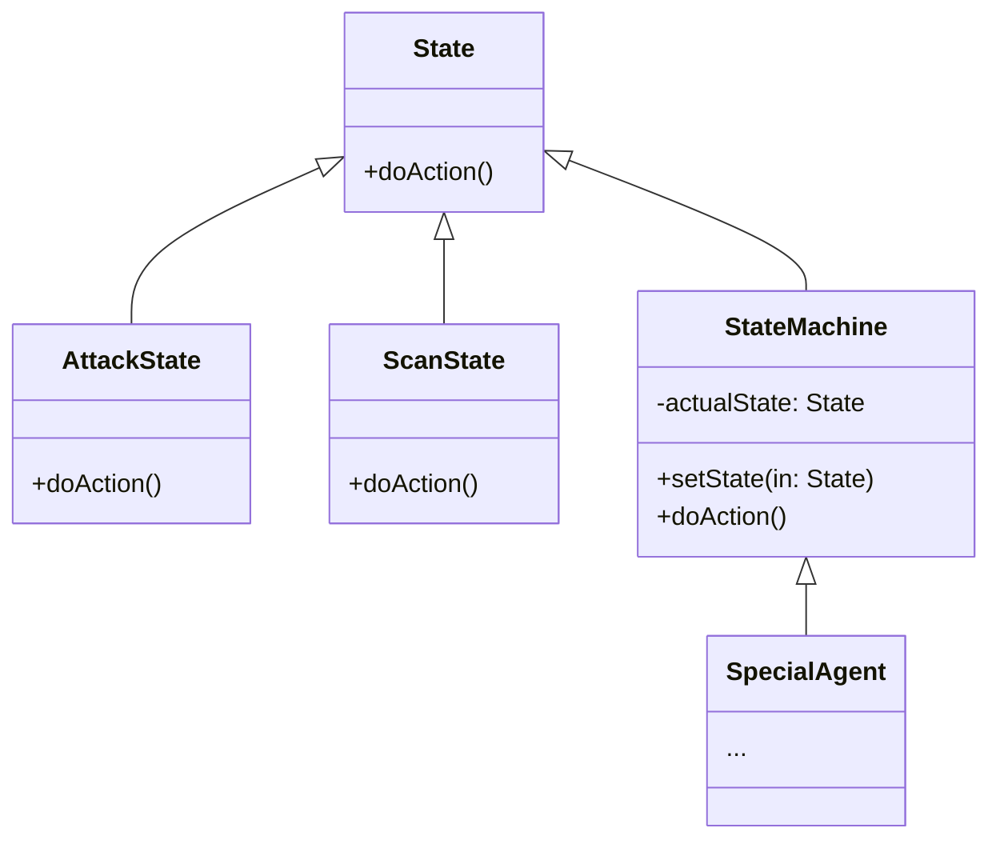
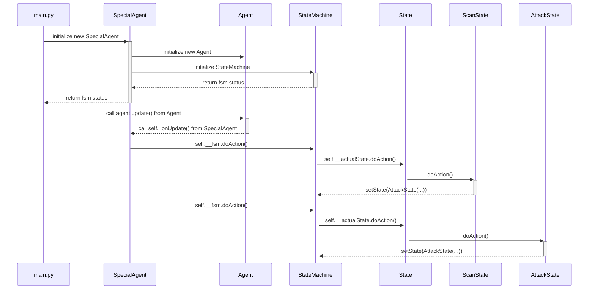

Diagramme état / transition

Classe mère State \
AttackState et SearchState hérite de State \

La StateMachine

## Diagramme de classe

```mermaid
classDiagram
    State <|-- AttackState
    State <|-- ScanState
    State <|-- StateMachine
    StateMachine <|-- SpecialAgent
    State : +doAction()

    class AttackState{
      +doAction()
    }

    class ScanState{
      +doAction()
    }

    class StateMachine{
        -actualState: State
        +setState(in: State)
        +doAction()
    }

    class SpecialAgent{
        ...
    }


```

## Diagramme de séquence

```mermaid
sequenceDiagram
    main.py->>+SpecialAgent: initialize new SpecialAgent

    SpecialAgent->>+Agent: initialize new Agent
    SpecialAgent->>+StateMachine: initialize StateMachine
    StateMachine-->>-SpecialAgent: return fsm status

    %%SpecialAgent->>+StateMachine: setState(ScanSate(...))
    %%StateMachine->>+ScanState: initialize ScanState
    %%ScanState->>+State: initialize State

    SpecialAgent-->>-main.py: return fsm status

    main.py->>+Agent: call agent.update() from Agent
    Agent-->>-SpecialAgent: call self._onUpdate() from SpecialAgent

    SpecialAgent->>+StateMachine: self.__fsm.doAction()
    StateMachine->>+State: self.__actualState.doAction() 
    State->>+ScanState: doAction()

    ScanState-->>-StateMachine: setState(AttackState(...))

    SpecialAgent->>+StateMachine: self.__fsm.doAction()
    StateMachine->>+State: self.__actualState.doAction() 
    State->>+AttackState: doAction()

    AttackState-->>-StateMachine: setState(AttackState(...))
```